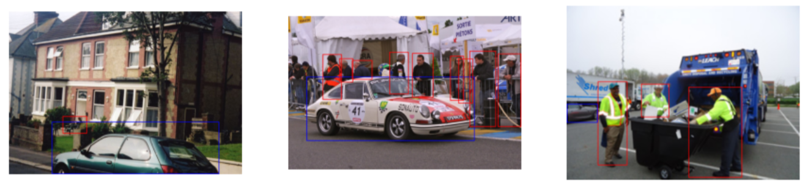
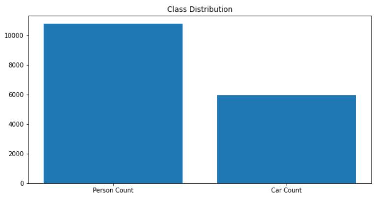
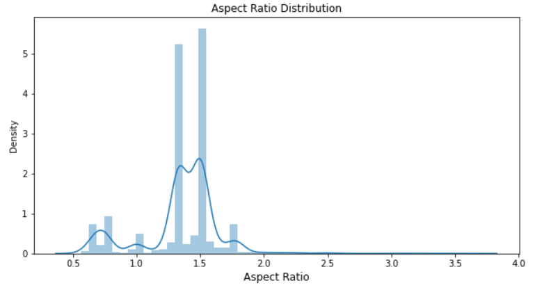
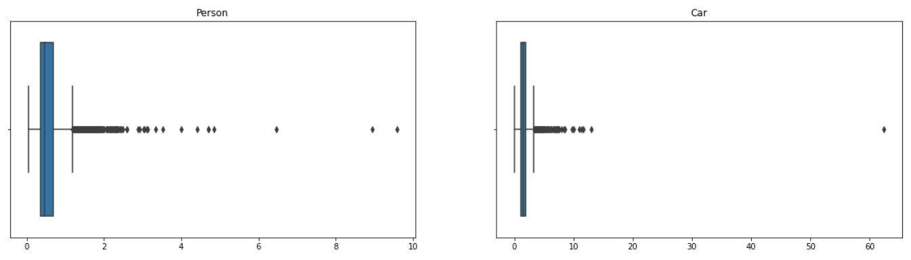
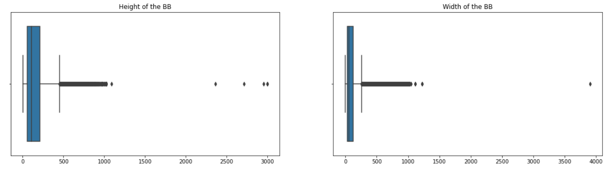
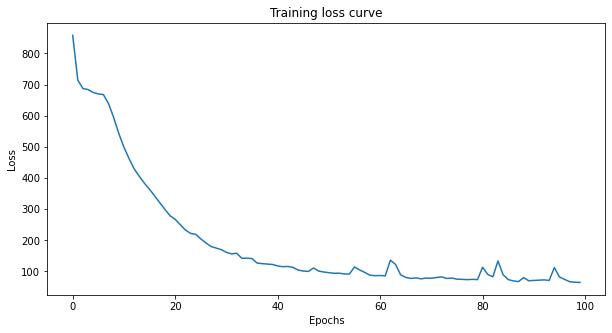

# Detecting person and car in real-time

## Problem Statement
The goal of this project is to train a model that can localize and classify each instance of person and car as accurately as possible. Here, we experiment on one of the famous object detection network - RetinaNet

Sample:

### Exploratory Data Analysis:

Total number of images in the data - 2239
As the dataset consist of two classes as people and car. The distribution of data between these classes are as below

Furthermore, aspect ratio of the images in the dataset are also analysed to decide on the resizing parameter for training in order to reduce memory.

 

Found that the aspect ratio of images are of high variance, the resizing is being avoided but with actual size of the image. Since the use of fully convolutional network can support images of any size, the resizing can be avoided. 
In the object detection network, the aspect ratio of bounding boxes are needed to be analysed carefully to tune the anchor box parameters. The anchor box size and aspect ratios can be varying based on the dataset. Here, the aspect ratio (width/height) of the people and car boxes are found to be as follows

Before training, the aspect ratio of anchor boxes are set with 1, 2 and 5 as most of the boxes are seen wihin this aspect ratios. Also, the anchor boxes size are fixed as 32, 64, 128, 512 and 1024 which is infered from the data. The below box chart explains the same

### RetinaNet Object detection
RetinaNet has a good balance between speed and accuracy. With ResNet+FPN as backbone for feature extraction, plus two task-specific subnetworks for classification and bounding box regression, forming the RetinaNet, which achieves state-of-the-art performance, outperforms Faster R-CNN. 

Reason behind choosing the RetinaNet model:

1. As there is a class imblance problem with our dataset, a two stage network can work better such as Faster-RCNN and as RetinaNet outperforms the Faster-RCNN, it has been chosen
2. Use of Focal Loss can improve performance more

### Training
The 90 percent of data has been chosen to train and validated the model's performance on remaining 10 percent. The training curve is as below and it is found to be improving throughout the epoch and have been trained for 100 epochs. 

### Testing and Performance analysis

