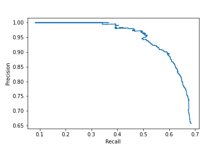
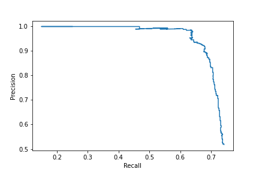

# Detecting person and car in real-time

## Problem Statement
The goal of this project is to train a model that can localize and classify each instance of person and car as accurately as possible. Here, we experiment on one of the famous object detection network - RetinaNet

Sample:

### Exploratory Data Analysis:

*Summary of the EDA*
* Class imbalance is present
* Size and aspect ratio of anchor box need to be tuned 
* Resizing can be avoided

Total number of images in the data - 2239

As the dataset consist of two classes as people and car. The distribution of data between these classes are as below

Furthermore, aspect ratio of the images in the dataset are also analysed to decide on the resizing parameter for training in order to reduce memory.

 

Found that the aspect ratio of images are of high variance, the resizing is being avoided but with actual size of the image. Since the use of fully convolutional network can support images of any size, the resizing can be avoided. 
In the object detection network, the aspect ratio of bounding boxes are needed to be analysed carefully to tune the anchor box parameters. The anchor box size and aspect ratios can be varying based on the dataset. Here, the aspect ratio (width/height) of the people and car boxes are found to be as follows

Before training, the aspect ratio of anchor boxes are set with 1, 2 and 5 as most of the boxes are seen wihin this aspect ratios. Also, the anchor boxes size are fixed as 32, 64, 128, 512 and 1024 which is infered from the data. The below box chart explains the same

### RetinaNet Object detection
RetinaNet has a good balance between speed and accuracy. With ResNet+FPN as backbone for feature extraction, plus two task-specific subnetworks for classification and bounding box regression, forming the RetinaNet, which achieves state-of-the-art performance, outperforms Faster R-CNN. 

Reason behind choosing the RetinaNet model:

1. As there is a class imblance problem with our dataset, a two stage network can work better such as Faster-RCNN and as RetinaNet outperforms the Faster-RCNN, it has been chosen
2. Use of Focal Loss can improve performance more

### Assumptions

Before training, 
* From the data analysis, the aspect ratio of the bounding boxes are assumed based on the distrubution found. 
* FPN network is utilized for better feature extraction and class imbalance is being addressed with RetinaNet.
* The PR curve is used to analyse the performance of the model.
* The dataset does not contain outlier or false labelling.

### Training
The 90 percent of data has been chosen to train and validated the model's performance on remaining 10 percent. The training curve is as below and it is found to be improving throughout the epoch and have been trained for 100 epochs. 

To get the pre-trained model - access this [link](https://drive.google.com/file/d/1iy_NGDzRUAU6Ejqv2SSCa5ySdGVjBrfg/view?usp=sharing)

### Testing and Performance analysis

From the 10 percent testing data , the below are the class-wise results

* Person class- 'avg_prec': 0.6227421925096344
* Car class - 'avg_prec': 0.7108190673577496

Also the PR curv of the validation data are as below

Person-PR curve:

Car-PR curve:

Sample video result:

The model has been trained only for 100 epochs but can continue the training as the loss curve is seems to be decreasing over the epochs. Also, recent models such as DETR can be utilized for better performance along with more data. 

References:
1. MAP and PR curve-  https://towardsdatascience.com/evaluating-performance-of-an-object-detection-model-137a349c517b
2. RetinaNet - https://towardsdatascience.com/review-retinanet-focal-loss-object-detection-38fba6afabe4

